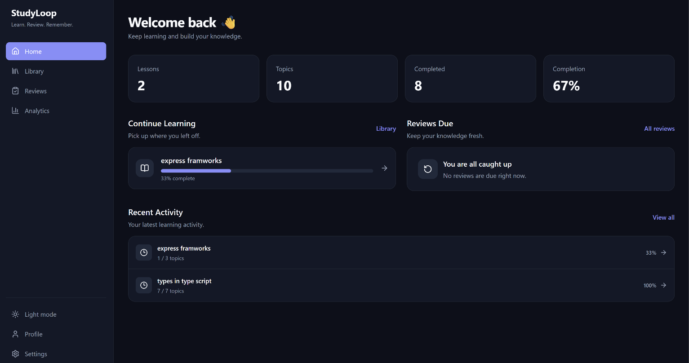
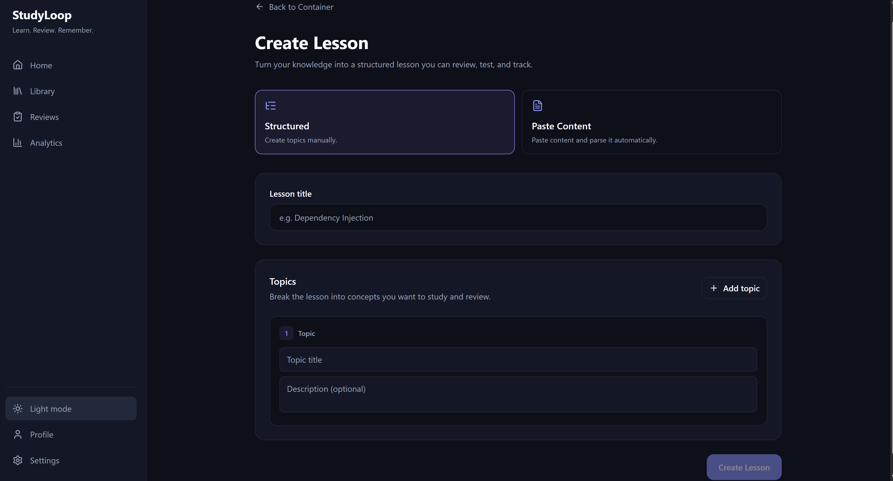
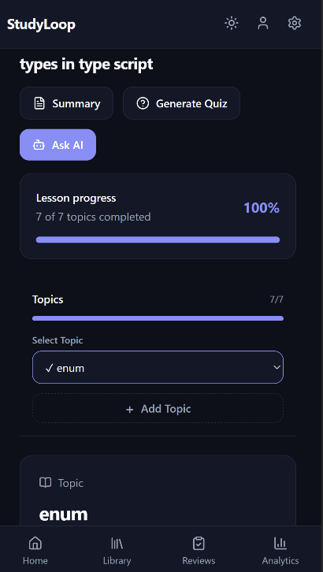
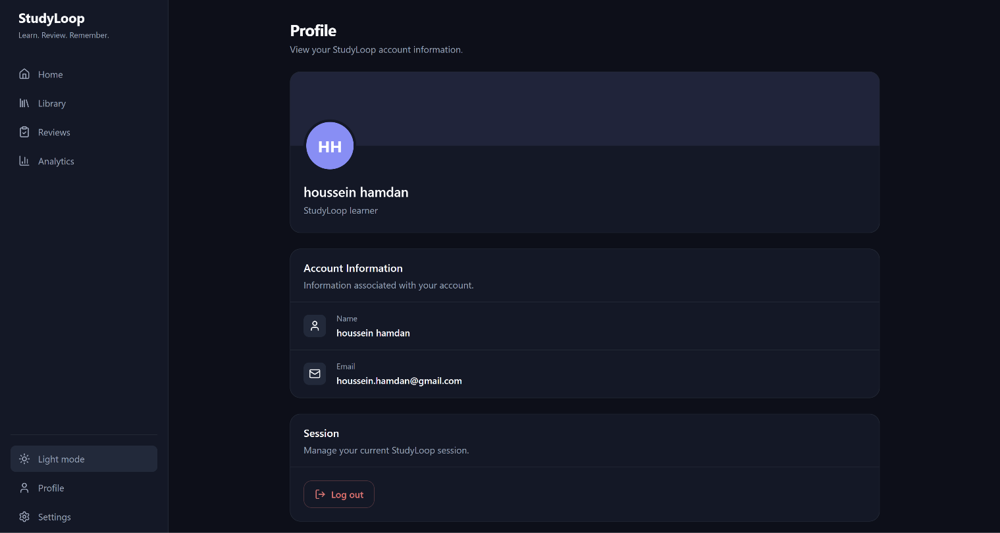
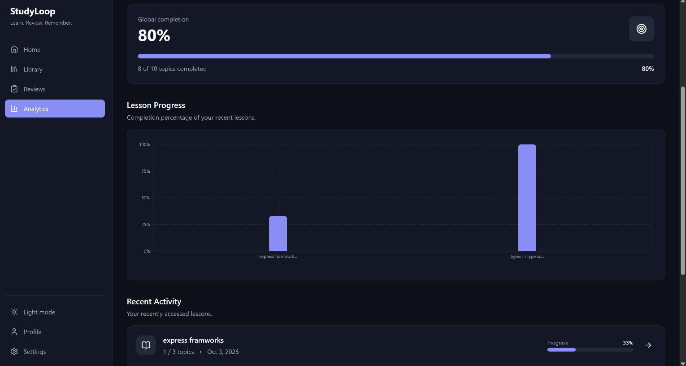

# 🧠 StudyLoop — AI-Powered Learning & Retention Platform

> Turn scattered learning material into structured lessons, review it intelligently, test your knowledge, track your progress, and ask AI when you need help.

🔗 **Live Demo:** [StudyLoop](https://study-loop-ten.vercel.app)
📂 **GitHub:** [Houssein-Hamdan/StudyLoop](https://github.com/Houssein-Hamdan/StudyLoop)

---

## 🎯 Overview

**StudyLoop** is a full-stack learning and knowledge-retention platform built around a simple problem:

> **Studying something once does not mean you actually remember it.**

Instead of being another note-taking application, StudyLoop combines:

- 📚 Structured learning
- 🧩 Topic-level progress tracking
- 🔄 Spaced repetition
- 🧠 AI-generated summaries
- ❓ AI-generated quizzes
- 💬 Context-aware AI assistance
- 🖍️ Personal annotations
- 📊 Learning analytics
- 🔗 Lesson sharing

The core learning loop is:

```text
Learn
  ↓
Review
  ↓
Test
  ↓
Track
  ↓
Improve
  ↓
Repeat
```

---

## ✨ Core Features

### 📚 Containers & Lessons

Organize learning material into:

```text
Container
   └── Lesson
        ├── Topic
        ├── Topic
        └── Topic
```

Users can create containers, lessons, and topics and manage them throughout the learning process.

### 📝 Flexible Lesson Creation

Two creation modes are supported:

**Structured Mode**

Create a lesson manually with topics and descriptions.

**Paste Mode**

Paste raw learning material and let the backend process it into a structured lesson.

Useful for lecture notes, documentation, articles, and personal study material.

### 📊 Topic-Level Progress

Progress is tracked at the topic level rather than simply marking an entire lesson as complete.

The system tracks:

- Completed topics
- Completion percentage
- Lesson completion
- Scroll position
- Review information

### 🔄 Spaced Repetition

StudyLoop schedules reviews using intervals such as:

```text
1 → 3 → 7 → 14 → 30 → 60 days
```

Users can see lessons due for review and continue their learning cycle.

### 🧠 AI Learning Tools

StudyLoop integrates Google Gemini to provide:

- AI-generated summaries
- AI-generated quizzes
- Context-aware AI questions
- Raw-content processing

AI requests are handled by the backend rather than directly from the browser.

### ❓ Quizzes

Quizzes can be generated for:

- Entire lessons
- Selected topics
- Random topics

Supported question types include:

- Multiple choice
- True / False
- Open text
- Fill in the blanks

Correct answers remain server-side and are only used when evaluating submissions.

### 📈 Analytics & Dashboard

The dashboard provides an overview of the learner's activity:

- Total lessons
- Total topics
- Completed topics
- Completion rate
- Lessons in progress
- Reviews due
- Quiz statistics
- Recent activity

### 🖍️ Annotations

Users can attach personal notes and annotations to learning topics.

### 🔗 Lesson Sharing

Lessons can be shared through public links without exposing the user's private workspace.

### 🌙 Responsive UI

StudyLoop supports desktop and mobile layouts with light/dark themes and responsive topic navigation.

---

## 🏗️ Architecture

StudyLoop uses a **React frontend + NestJS modular monolith backend + PostgreSQL**.

```text
┌──────────────────────┐
│    React Frontend    │
│                      │
│ React + TypeScript   │
│ TanStack Query       │
│ React Router         │
└──────────┬───────────┘
           │
        REST API
           │
           ▼
┌──────────────────────┐
│     NestJS API       │
│                      │
│ Auth                 │
│ Containers           │
│ Lessons              │
│ Progress / Reviews   │
│ Quizzes              │
│ Summaries            │
│ Annotations          │
│ Gemini Integration   │
└──────────┬───────────┘
           │
           ▼
     ┌────────────┐
     │ PostgreSQL │
     └────────────┘
```

### Backend Flow

```text
Controller
    ↓
Service
    ↓
Repository
    ↓
PostgreSQL
```

The backend is organized as a **modular monolith**, keeping business domains separated without introducing unnecessary microservice complexity.

### Frontend Flow

```text
React Component
      ↓
Feature Hook
      ↓
API Function
      ↓
Axios
      ↓
NestJS API
```

TanStack Query is used for server-state management, caching, mutations, and query invalidation.

---

## 🛠️ Tech Stack

### Frontend

- React
- TypeScript
- Vite
- React Router
- TanStack Query
- React Hook Form
- Zod
- Tailwind CSS
- Axios
- Recharts
- Lucide React

### Backend

- NestJS
- TypeScript
- TypeORM
- PostgreSQL
- JWT + Passport
- bcrypt
- class-validator
- Google Gemini API

---

## 🧠 Key Engineering Decisions

### Modular Monolith

A modular monolith was chosen instead of microservices because the project is developed by a small team / individual developer and does not require distributed infrastructure.

This keeps domain boundaries clear while avoiding unnecessary operational complexity.

### PostgreSQL

PostgreSQL was chosen because the application contains strongly relational data:

```text
User
 ↓
Container
 ↓
Lesson
 ↓
Topic
 ↓
Progress
 ↓
Quiz
```

### Repository Pattern

Persistence logic is separated from business logic:

```text
Service
   ↓
Repository
   ↓
TypeORM
   ↓
PostgreSQL
```

### Dependency Injection

NestJS dependency injection keeps modules loosely coupled and improves testability.

### Server-Side AI

Gemini requests go through the backend to keep API credentials secure and centralize AI prompting, validation, and response handling.

### User-Specific Progress

Topic structure and user progress are kept separate:

```text
Topic
  ≠
UserTopicProgress
```

This allows the same learning structure to remain independent from each user's progress.

---

## 🔐 Security

StudyLoop implements:

- JWT authentication
- Password hashing with bcrypt
- DTO validation
- Protected API routes
- Resource ownership checks
- User-specific progress
- Server-side AI credentials
- Server-side quiz answer validation
- CORS configuration
- Bearer-token authentication

---

## 📁 Project Structure

```text
StudyLoop/
│
├── studyloop-frontend/
│   └── src/
│       ├── app/
│       ├── features/
│       │   ├── auth/
│       │   ├── containers/
│       │   ├── lessons/
│       │   ├── progress/
│       │   ├── reviews/
│       │   ├── quizzes/
│       │   ├── summaries/
│       │   ├── ask/
│       │   ├── annotations/
│       │   └── analytics/
│       ├── components/
│       ├── hooks/
│       ├── lib/
│       ├── types/
│       └── main.tsx
│
├── studyloop-backend/
│   └── src/
│       ├── modules/
│       │   ├── auth/
│       │   ├── container/
│       │   ├── lesson/
│       │   ├── progress/
│       │   ├── quiz/
│       │   ├── summary/
│       │   ├── annotation/
│       │   └── gemini/
│       ├── entities/
│       ├── config/
│       └── main.ts
│
└── README.md
```

---

## 💻 Local Setup

### Prerequisites

- Node.js
- npm
- PostgreSQL
- Git
- Gemini API key

### Backend

```bash
cd studyloop-backend
npm install
```

Create `.env`:

```env
PORT=3000

DATABASE_HOST=localhost
DATABASE_PORT=5432
DATABASE_USERNAME=postgres
DATABASE_PASSWORD=your_password
DATABASE_NAME=studyloop

JWT_SECRET=your_jwt_secret
GEMINI_API_KEY=your_gemini_api_key
```

Run:

```bash
npm run start:dev
```

### Frontend

```bash
cd studyloop-frontend
npm install
```

Create `.env`:

```env
VITE_API_URL=http://localhost:3000
```

Run:

```bash
npm run dev
```

---

## 📸 Screenshots

### Home



### Lesson



### Mobile



### Profile



### Analytics



---

## 🚀 Future Improvements

- More advanced spaced-repetition algorithms
- Personalized AI learning recommendations
- Better quiz analytics
- Advanced search
- Lesson version history
- Collaborative lessons
- Offline learning
- Mobile application
- Notification and reminder system
- Improved content import

---

## 📌 Project Status

StudyLoop is an actively developed full-stack project built as a practical exploration of:

- Full-stack development
- REST API design
- Database architecture
- Authentication & authorization
- Modular architecture
- Dependency Injection
- Repository Pattern
- Server-state management
- AI integration
- Progress tracking
- Spaced repetition
- Responsive UI

The project is built to demonstrate not only feature development, but also **software engineering and architectural thinking**.

---

## 📧 Contact

**Hussein Hamdan**

- **GitHub:** [@Houssein-Hamdan](https://github.com/Houssein-Hamdan)
- **LinkedIn:** [Hussein Hamdan](https://www.linkedin.com/in/hussein-hamdan-04504542b)
- **Email**: [houssein.hamdn@gmail.com](houssein.hamdn@gmail.com)

---

> **Learn → Review → Test → Track → Improve → Repeat**

**Made with ❤️ by Hussein | 2026**
